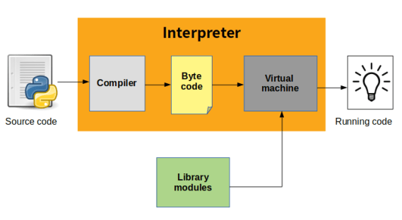

# Python Introduction

1. It's named after the cult comedy show **"Monty Python's Flying Circus"**.

2. It was created by **"Guido Van Rossum"** and released in **1991**. (*Guido is pronounced as "Geeudo"*)

3. Python is easy to use.

4. Python is an **object-oriented, interpreted, and a high level language**.

## Python: Compiled and Interpreted Language



1. **Truth About Python:**
    The truth is:
    - Python is both an ***interpreted and a compiled language***.
    - But calling Python a compiled language would be misleading.

2. **Execution Flow in Python:**

    - When you run the program using:

        ```shell
        python filename.py
        ```

   - Python code(filename.py) is first translated into intermediate code (byte code) by an internal compiler.

   - This bytecode is stored as filename.pyc (lower-level, platform-independent representation of your source code).

    - The bytecode is then interpreted and executed by the Python Virtual Machine (PVM).

    - The final output is displayed.

    - ***Note:*** All these steps (compilation to bytecode and interpretation by PVM) are handled internally by Python.

3. **Error Handling in Python:**

   - **Compiler (Bytecode Generation)**: Detects **syntax errors** (e.g., missing colons, invalid indentation). If found, compilation halts, and execution doesn't proceed.
   - **Interpreter (PVM Execution)**: Detects **runtime errors** (e.g., division by zero, undefined variables) line by line during execution and reports them immediately.