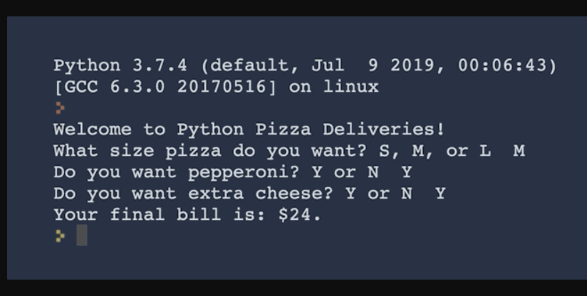
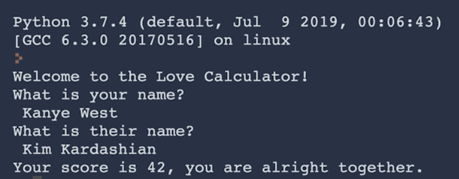
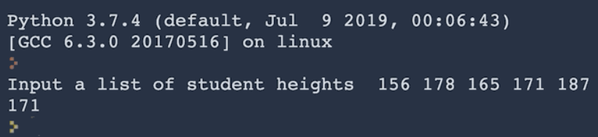
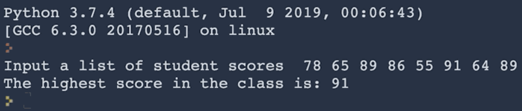

# Python Questionnaire

* WAP to print that takes input as name from user and prints "Hello, name".  

---

* WAP that prints the length of characters in your name.

---

* WAP to swap 2 numbers.

---

* WAP to reverse a string.

---

* WAP that adds the digits in a 2 digit number. e.g. if the input was 35, then the output should be 3 + 5 = 8.  
  Also modify it for dyname digit number.

---

* WAP that tells us how many days, weeks, months we have left if we live until 90 years old.  

        Eg:
            I/P: 56
            O/P: You have 12410 days, 1768 weeks, and 408 months left.  

    > Condition: There are 365 days in a year, 52 weeks in a year and 12 months in a year.

---

* WAP that calculates the bill (including tip), splits the bill with the people and prints the price that each person has to pay.
Round off the bill to 2 decimal places.

    > Conditions: Tip percentage available: 5%, 10%, 15%.

---

* WAP that checks whether if a given number is an odd or even number.

---

* WAP that interprets the Body Mass Index (BMI) based on a user's weight and height.  
  BMI = weight (kg) / height ^2(m^2)  
  Round the result to the nearest whole number.

    It should tell them the interpretation of their BMI based on the BMI value.  
  * Under 18.5 they are underweight  
  * Over 18.5 but below 25 they have a normal weight  
  * Over 25 but below 30 they are slightly overweight  
  * Over 30 but below 35 they are obese
  * Above 35 they are clinically obese

        Eg:
            I/P: 
                weight = 85
                height = 1.75 
            O/P:
                Your BMI is 28, you are slightly overweight.

---

* WAP that checks whether a given year is leap year or not.

---

* WAP to build an automatic pizza order program.Based on a user's order, work out their final bill.

    Prices:  

  * Small Pizza: $15  
  * Medium Pizza: $20  
  * Large Pizza: $25  
  * Pepperoni for Small Pizza: +$2  
  * Pepperoni for Medium or Large Pizza: +$3  
  * Extra cheese for any size pizza: + $1  

    Eg:
    

---

* WAP that tells compaitibility between 2 people (Love Calculator).  

```
  To work out the love score between two people:
    1. Take both people's names and check for the number of times the letters in the word TRUE occurs.
    2. Then check for the number of times the letters in the word LOVE occurs.
    3. Then combine these numbers to make a 2 digit number.  
```

```
  1. For Love Scores less than 10 or greater than 90, the message should be:  
        "Your score is **x**, you go together like coke and mentos." 

  2. For Love Scores between 40 and 50, the message should be:  
        "Your score is **y**, you are alright together."  

  3. Otherwise, the message will just be their score. e.g.:  
        "Your score is **z**."
```

> Hint: Use count() method of `str` class.

  Eg:
   

---

* Write a virtual coin toss program. It will randomly tell the user "Heads" or "Tails".  
  Hint: Use random module.

---

* Write a program that will select a random name from a list of names. The person selected will have to pay for everybody's food bill.  
  Do this program with 2 ways:
  1. With random.choice() function
  2. Wihout random.choice() function

---

* WAP to play rock, paper, scissors with computer.

---

* WAP to print all the separators from a number.  
  number  = "9,223:833,329.3928"

---

* WAP that calculates the average student height from a List of heights.
  > Condition: You should not use the sum() or len() functions in your answer.

  Eg:
    

---

* WAP that calculates the highest score from a List of scores.
  > Condition: you are not allowed to use the max or min functions.

  Eg:
  

---

* WAP that calculates the sum of all the even numbers from 1 to 100.

---

* WAP that automatically prints the solution to the FizzBuzz game. (FizzBuzz)  
  
  Conditions:

  ```
  1. Your program should print each number from 1 to 100 in turn.

  2. When the number is divisible by 3 then instead of printing the number it should print "Fizz".

  3. When the number is divisible by 5, then instead of printing the number it should print "Buzz".`

  4. And if the number is divisible by both 3 and 5 e.g. 15 then instead of the number it should print "FizzBuzz"

  ```

---

* Create a Password Generator

---

* WAP to print out capital letters in the string.
  
  >quote = """Alright but apart from the Sanitation, the Medicine, Education, Wine, Public, Order, Irrigation, Roads,
  the Fresh-Water System and Public Health, what have the Romans ever done for us? """

---

* WAP that prints multiplication table of a number entered by the user.

---

* WAP that takes name of the item from user and prints the position where it is located in the list.
  
  >shopping_list = ["pasta", "eggs", "milk", "chocolate", "bread", "rice"]

---

* WAP for the game Hangman.

---

* WAP to calculate the no of cans required to paint the wall using a function.  
  The instructions on the paint can says that 1 can of paint can cover 5 square meters of wall.  
  Result should be rounded to the ceil value.

  > number of cans = (wall height x wall width) ÷ coverage per can.

---

* WAP that checks whether if the number passed into it is a prime number or not using a function.
  
---

* WAP for the encryption and decryption of a string. (Caesar Cipher)

---

* WAP using a function to calculate the sum of even or odd number based on the last number enterd by the user.

---

* WAP to using a function to check whether a given string/sentence is pallindrome or not.

---

* WAP to print fibonacci series using a function.

---

* WAP to print factorial of a number using a function.

---

* WAP to get the domain name from email.

---

* WAP to remove duplicates from a list without using sets.

---

* WAP to display highest, lowest, 2nd highest, 2nd lowest value from a list.  

  > list1 = [4, 1, 2, 2, 1, 3, 4, 2, 5, 5, 1, 6, 5, 9]

---

* WAP to get the the valid integer value from the user.

---

Resources:

* ASCII ART: <https://ascii.co.uk/art>
